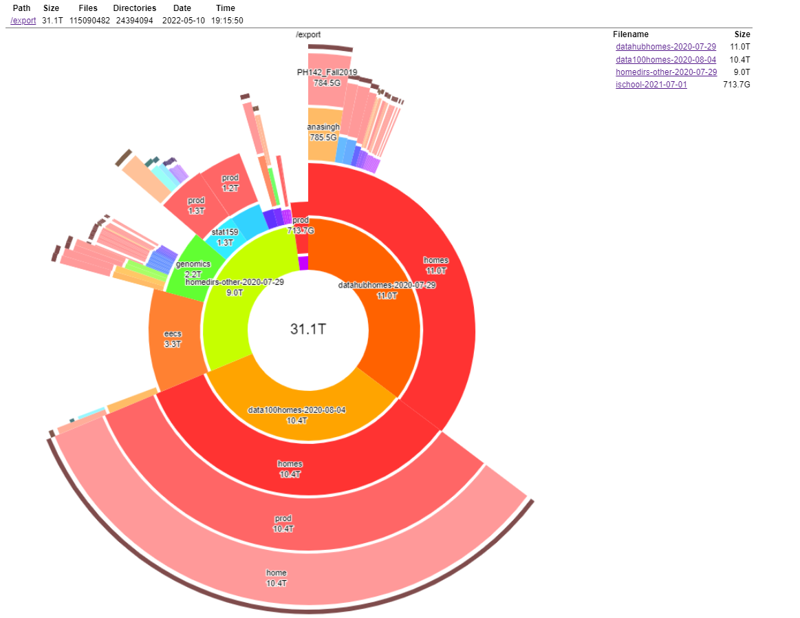
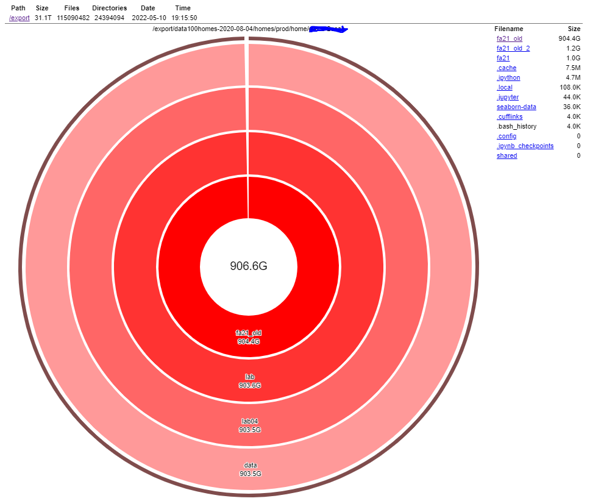
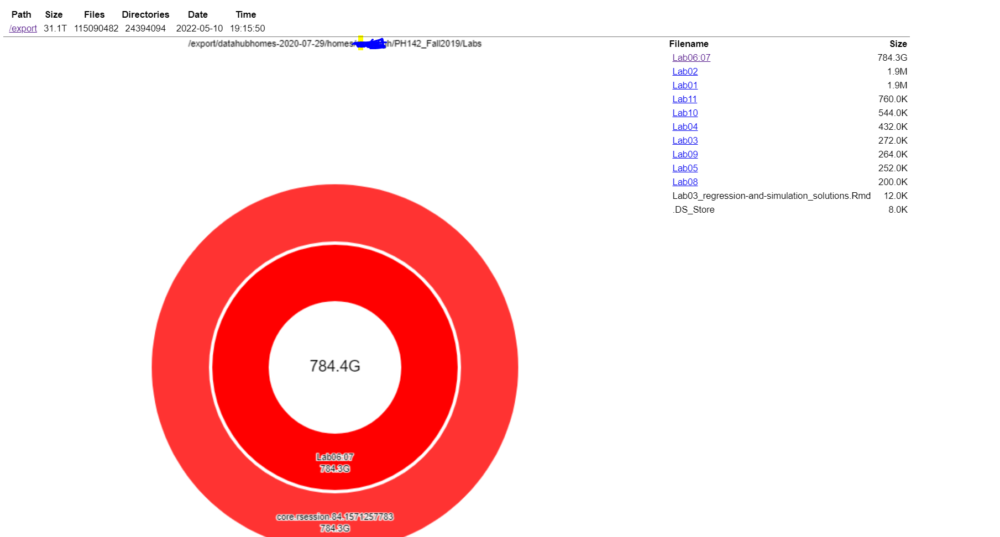
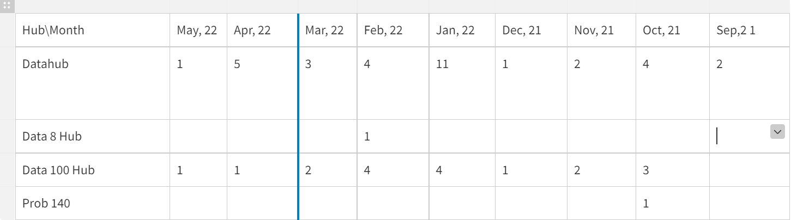

# Storage Policy

The goal of this policy document is to develop a short-term and long-term policy outlook for archiving user home directories across all hubs.

Currently (as of 5/12/2021), our disk storage snapshot looks like this below. We have 31 TB of storage accumulated across all disks.

## Policy proposal for users with home directory size greater than 100 GB

We found [multiple instances](https://docs.google.com/document/d/1KsMmRq4rf40kEazQYwEgFpaz__N7-yauG9nvN-3C3lw/edit?usp=sharing) where users stored more than 100 GB worth of data during the recent disk storage analysis. Such users home directory size approximates to around ~3 TB of storage which includes large and complex datasets.
Interestingly, Many users did not even log into their instances of the hub during the past 6 - 12 months. 

One of the user home directory snapshotted below had a database file named "fec_nyc.db" whose size was around ~900 GB of data. This database file was used as part of the Data 100 course lab 4 where students learn to work with a database using the SQLAlchemy package. 

Another user had a core.rsession file whose size was around 785 GB. She had this file under the course directory PH142_Fall2019 (Ph142 is the abbreviation for the course "Introduction to Probability and Statistics in Biology and Public Health").

We paid additional cloud storage costs amounting to few TB of data due to such user actions. Inorder to avoid such scenarios, we need to regularly run jobs to measure and visualize disk size. It will help us to identify and correct user actions before it costs us a lot of $$$.

Policy recommendation is to **not archive any user's home directories whose files size are greater than 100 GB**. Infra team should reach out to the concerned user(s) to inform them about their current storage status and request them to back up their data within 30 days post which the data gets deleted.

## Policy proposal for users home directory archival

As shown in the snapshot below, We had 54 archival requests in total during the course of past two semesters (from Sep, 21 to May, 22). 

99% of the archival requests were made for two different hubs - Datahub and Data 100 hubs. We can hypothesize that most users using other hubs are either a) not aware of the archival service or b) do not require the service. If we plan to improve our outreach message to ensure that other hub users are aware of the archival process, we may still run into issues with our capacity to handle such requests.  We collectively identify that the manual storage archival process is something we want to move away from via automation.

Less than 1% (~50) of all Datahub users (~10k) make data archival requests. To solve this demand from a small subset of users, we allocate a significant amount of storage (as much as 31 TB) as shown in the first snapshot above. Google cloud estimator hypothesizes that it may cost us closer to $5000 per year for storing this volume of data. Here is a [link](https://cloud.google.com/products/calculator/#id=686b9639-ae2e-4a94-a5b9-30aeb1135e6c) to an approximate estimate of cloud costs. 

As part of this proposal, let's explore the radical proposal of evaluating whether we need to have an archival process in the first place.

### Policy options to be considered:

**Option #1:** 
Eliminate archival process completely. Allow users to download all their Hub data up to 3 months from the time of their course completion post which the data gets deleted from the hub. Send automated alerts at consistent intervals during this period to ensure that users are aware of the impending deadline.

**Pros:** 
- Eliminate archival requests completely by proactively asking users to back up their files.
- Significant cloud cost savings at our end
- Hub admin's time saved from responding to all archival requests
- Need not invest infrastructure efforts to automate archival requests

**Cons:**
- 10 - 15% of users who reach out for archival requests may fail to back up their files despite the repeated nudges

**Option #2:**
Archive only the notebook files (files with ipynb,rmd, .r, and .jl extensions) having code. The rest of the non-notebook files including the datasets are deleted after 3 months of course completion. Or the datasets could be stored in a shared read directory or google drive from where students can import them into their notebooks. 

**Pros:**
- Users can request their notebook files months after their course completion.
- Significant cloud cost savings at our end as most notebook files are smaller in file size in comparison to the datasets
- Can automate only this part of the archival process if required

**Cons:**
- The workload for hub admins to respond to archival requests remains the same
- Users will not have access to their datasets

**Option #3:**
Keep the archival service as-is while automating the entire process. Increase the outreach to the different instructors to ensure that all users have equitable access to this service.

**Pros:** 
- More users beyond Data 100 and Datahub will have awareness about retrieving their data

**Cons:**
- Storage keeps increasing with additional cloud costs incurred for the infra team
- An additional effort from the infra team to manage storage-related tasks like responding to archival requests, reviewing storage consistently, increasing storage when disk size is nearly full, etc.